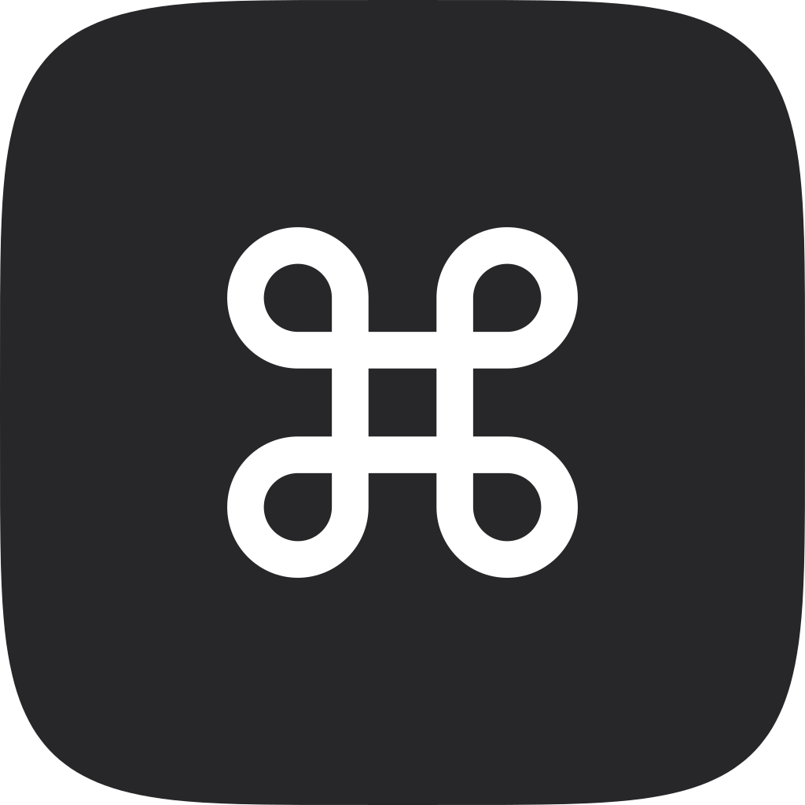

# Moli Mac 桌面



一个 macOS 菜单栏工具，先做鼠标增强：侧键手势、平滑滚动、模拟触控板。

[](https://github.com/MoliDuo/MoliMac/actions/workflows/ci.yml)
[](https://github.com/MoliDuo/MoliMac/releases/latest)


> 开发中。鼠标模块参照 [Mac Mouse Fix](https://github.com/noah-nuebling/mac-mouse-fix) 重新实现；Dock 预览、窗口切换、菜单栏管理以后作为别的模块加进来。

## 功能

- **按键**：中键和侧键可以绑定单击、双击、按住、按住拖动、按住滚动。
  - 默认：侧键 4 单击查询，按住滚动切桌面和启动台，按住拖动切桌面和调度中心；侧键 5 单击智能缩放，按住滚动缩放，按住拖动滚动页面和前进后退。
  - 动作：调度中心、应用窗口、显示桌面、启动台、左右切换桌面、聚焦搜索、查询、智能缩放、前进后退、中键点击、自动滚动（Windows 那种）、自定义快捷键。
- **滚动**：平滑滚动（关、低、中、高），模拟触控板（Safari 横滑返回、回弹），滚动速度，反转方向。
- **滚动时按住修饰键**：⇧ 横向，⌘ 缩放，⌃ 快速，⌥ 精确。
- **指针**：关闭指针加速，调节指针速度（只影响鼠标）。
- **按 App 设置**：某个 App 里停用，或者单独设置按键和滚动；按指针下面的 App 生效。
- **通用**：菜单栏一键暂停，登录时打开，应用内更新。

## 安装

1. 在 [Releases](https://github.com/MoliDuo/MoliMac/releases/latest) 下载 `MoliMac_<版本>_macos_arm64.dmg`，把 Moli Mac 拖进「应用程序」。只支持 macOS 27（Apple 芯片）。
2. 应用用自签名证书签名，没有经过 Apple 公证：第一次打开如果被拦下，到「系统设置 › 隐私与安全性」点「仍要打开」。
3. 在「系统设置 › 隐私与安全性 › 辅助功能」里允许 Moli Mac。
4. 装着 Mac Mouse Fix 的话先退出它，两个同时运行会让每个动作执行两次。

之后的版本在应用里提示更新，菜单栏菜单里也可以「检查更新…」。

## 登录方式

不需要登录：本机运行的工具，没有账号，也不联网（检查更新除外）。

## 开发

需要 macOS 27 和 Xcode 27。

```bash
Scripts/check.sh              # 和 CI 一样的检查：格式、lint、编译（警告算错误）、单元测试
Scripts/check.sh --fix        # 自动格式化
Scripts/package-release.sh    # 打包 .build/MoliMac.app、DMG、ZIP
Scripts/verify-package.sh     # 检查打出来的包
```

第一次在这台 Mac 上开发先运行 `Scripts/setup-dev-signing.sh`：它在 `~/.moli-dev-signing` 建一张开发证书（单独的钥匙串文件，不进登录钥匙串），之后本地包都用它签名，辅助功能只需授权一次。没有它就是临时签名，每次重新打包都要重新授权。测试前先退出 Mac Mouse Fix。

目录：`Sources/MoliMacCore`（不依赖界面的逻辑：设置、按键手势的状态机、滚动曲线，全部有单元测试）、`Sources/MoliMacApp`（菜单栏、事件拦截、模拟事件、设置窗口）、`Config/`（图标、设计令牌、更新公钥）。设计说明见 [docs/architecture.md](docs/architecture.md)。

## 致谢

鼠标模块的手感和功能来自 Noah Nuebling 的 [Mac Mouse Fix](https://github.com/noah-nuebling/mac-mouse-fix)。本项目没有复制它的代码，只参考了它整理出来的系统事件字段和时间参数。

## 许可

保留所有权利，见 [LICENSE](LICENSE)。
